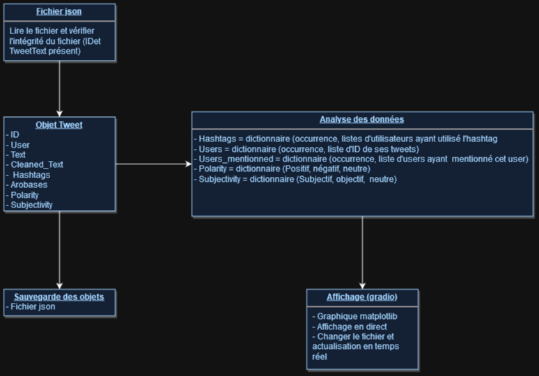

# InPoDa (Projet LSIN304)

## Groupe de TD : LDD-BI & INTD-04

## Étudiants :

* Alexandre François: [https://github.com/uvsq22201695](https://github.com/uvsq22201695)
* Maël Fajon: [https://github.com/matronyme2](https://github.com/matronyme2)

## Dépôt du projet GitHub :

[https://github.com/uvsq22201695/projet_in304](https://github.com/uvsq22201695/projet_in304)

## Introduction

InPoDa est un programme Python qui permet d'analyser des données de tweets. Il permet de charger des données de tweets à partir d'un fichier JSON, de les analyser et d'afficher des statistiques sur ces données. Il permet aussi de télécharger des données de tweets qui ont été analysées par le programme.

## Utilisation du programme

Le programme se lance avec des données initiales (fichier `aitweets.json`). Il est possible de charger un autre fichier de données en utilisant l'option `Drop file  Here` dans l'interface puis en cliquant sur le bouton `Envoyez`. Chaque fichier sera vérifié avant d'être chargé. Si le fichier n'est pas valide, un message d'erreur s'affichera sous forme de pop-up. Sinon le fichier sera chargé et les données seront affichées dans l'interface avec une fenêtre pop-up de confirmation.

Une fois les données chargées, il est possible de voir les statistiques de ces données en cliquant sur les différents boutons de l'interface. Les statistiques s'afficheront dans l'interface. Tout s'actualise en temps réel.

De plus vous pouvez télécharger les données analysées en cliquant sur le bouton bleu en bas de la page. Les données seront téléchargées dans un fichier JSON `zonedaterrissage.json`que vous pouvez consulter.

**Opérations possibles**

Le programme permet de réaliser les opérations suivantes :

* Identification de l’auteur de la publication => donnée de base (présent dans `zonedaterrissage.json`)
* Extraction de la liste de hashtags de la publication => donnée de base (présent dans `zonedaterrissage.json`)
* Extraction de la liste des utilisateurs mentionnés dans la publication => donnée de base (présent dans `zonedaterrissage.json`)
* Analyse de sentiment de la publication (positif, négatif, neutre) (utilisation de la librairie TextBlob) => donnée de base (présent dans `zonedaterrissage.json`)
* Identification du/des topic(s) de la publication => donnée de base (présent dans `zonedaterrissage.json`)

* Top K hashtags (k est un paramètre passé par l’utilisateur)
* Top K utilisateurs
* Top K utilisateurs mentionnés
* Top K topics
* Carte du nombre de publications par pays
* Le nombre de publications par utilisateur
* Le nombre de publications par hashtag
* L’ensemble de tweets d’un utilisateur spécifique
* L’ensemble de tweets mentionnant un utilisateur spécifique
* Les utilisateurs mentionnant un hashtag spécifique
* Les utilisateurs mentionnés par un utilisateur spécifique

## Exécution du programme

Pour exécuter le programme, il faut lancer la cellule en bas du Jupyter Notebook `README.ipynb` avec Python 3.11. Il faut aussi installer les modules nécessaires au bon fonctionnement du programme qui sont listés dans le fichier `requirements.txt`.

## Diagramme décrivant l'architecture du programme

